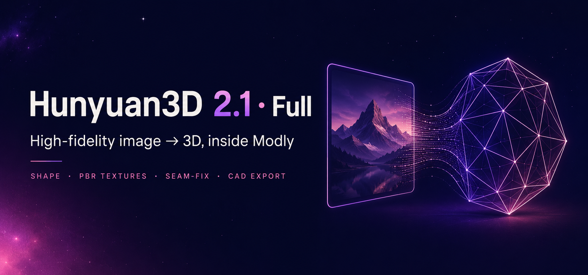
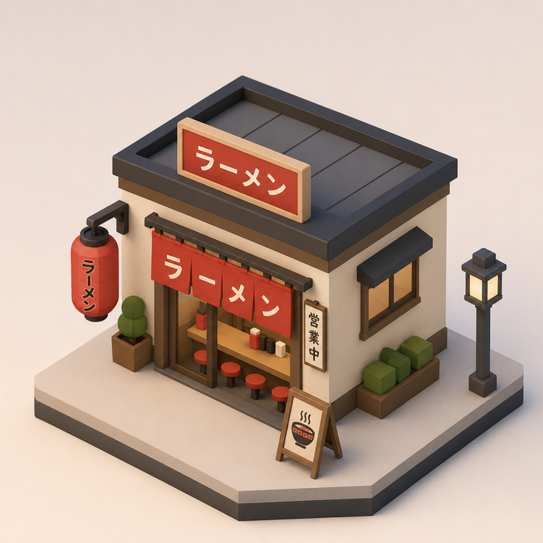
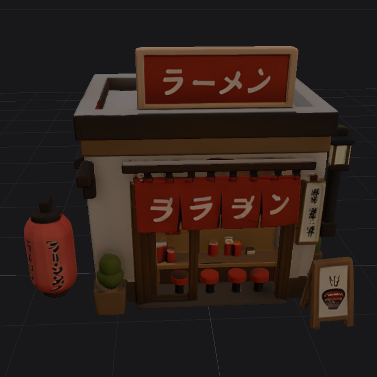
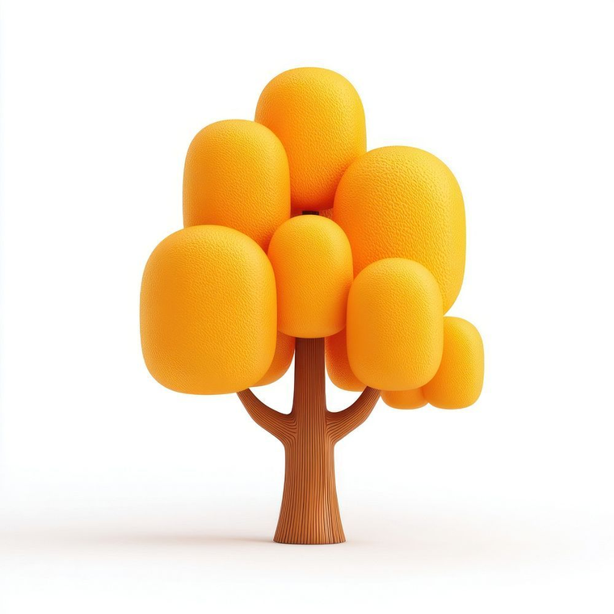
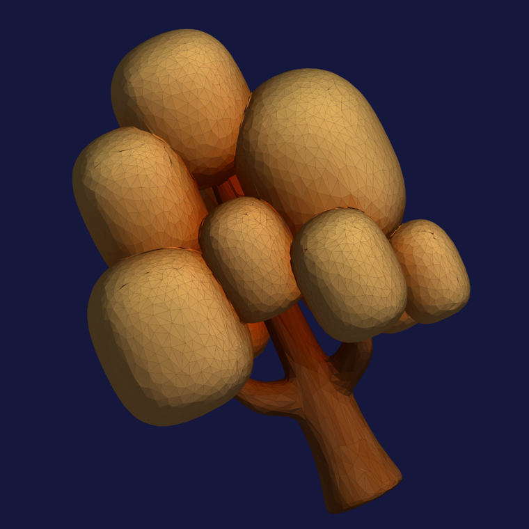
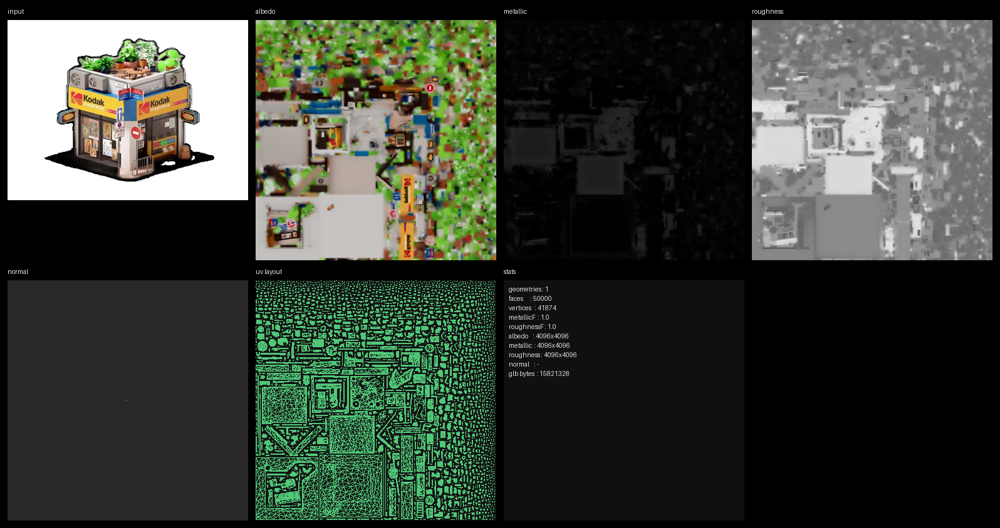

  
  
  
  
  

**Turn a single image into a high-fidelity 3D model — with optional PBR textures — right inside [Modly](https://github.com/lightningpixel/modly).**

Wraps the full **Hunyuan3D-2.1** shape checkpoint (Tencent's 3.3B `hunyuan3d-dit-v2-1`, not the lightweight Mini) with an optional paint pass.

---

## &#10024; Results

<table>
  <tr>
    <th width="50%">Input image</th>
    <th width="50%">Generated 3D (textured)</th>
  </tr>
  <tr>
    <td></td>
    <td></td>
  </tr>
  <!-- second row: pending a clean tree viewport shot (no app UI)
  <tr>
    <td></td>
    <td></td>
  </tr>
  -->
</table>

Generated on an RTX 3090 — shape at High quality, textured PBR pass. Modly's model viewport is unlit, so the same assets look richer in any lit renderer or game engine.

---

## &#9889; Quick start

1. In Modly: **Extensions &#8594; Install from GitHub**, paste this repo's URL. It builds its own isolated Python environment automatically.
2. Click **Download** on the model variant (~7.4 GB weights, one time).
3. Drop in an image and generate. Want color? Switch on **Generate textures (PBR)**.

> **Just want the shape?** It needs only ~10 GB VRAM and no build tools — leave textures off and you're done in under a minute on a modern card.

---

## &#129513; What's inside

- **Full 2.1 shape model** — the 3.3B `hunyuan3d-dit-v2-1` checkpoint, high-fidelity image&#8594;mesh geometry.
- **PBR texture pass** — albedo + packed metallic-roughness, painted from 6–9 camera views.
- **Seam-fix** — reconciles color jumps across UV-island edges so textures don't show hard seams (on by default).
- **Mesh cleanup** — Regular / Isotropic / BPT neural retopology, with automatic fallbacks.
- **CAD / print path** — optional decimation plus STEP / Fusion export (textures are dropped for solid CAD).
- **QA sheet** — an optional one-image diagnostic of every texture map (see the deep dive below).

---

## &#128190; Will it run on my GPU?

**Short answer: yes.**

- **Shape** generates on **~10 GB VRAM** with no build tools — comfortable on most modern NVIDIA cards.
- **Textures** are happiest on a **24 GB card** (~21 GB peak), **but you don't need one.** The **Texture memory** tiers scale the pass down to fit your card, and **Use shared GPU memory** lets a smaller GPU finish by borrowing system RAM. It's slower over PCIe, but a 12 GB card can still paint — it just takes longer.

The texture pass also needs a one-time C++/CUDA build toolchain (Visual Studio C++ Build Tools + a CUDA toolkit). Shape generation needs none, and if the toolchain is missing, texturing fails with a clear message while shape keeps working.

---

## &#127918; Deep dive

<b>&#127912; Textures (the PBR paint pass)</b>

 

Switch on **Generate textures (PBR)**. The extension runs shape first, frees the shape model from VRAM, paints the mesh with the `hy3dpaint` pipeline, then reloads shape for the next run. Output is a textured `.glb` with an **albedo** map and a **packed metallic-roughness** map (roughness in green, metallic in blue — the glTF standard).

**First run downloads** the `hunyuan3d-paintpbr-v2-1` weights, DINOv2-giant, and a RealESRGAN checkpoint.

> **Export GLB to keep the maps** — Modly's OBJ export drops textures.

<b>&#129529; Mesh cleanup</b>

 

The raw shape mesh is a dense marching-cubes surface (~2.6M faces at high resolution). Before painting it's cleaned into a UV-friendly base — you pick how with **Mesh cleanup**:

- **Regular** (default) — quadric decimation; one connected shell with clean UVs. The most reliable choice.
- **Isotropic** — uniform-triangle remesh; even topology, but can fragment Hunyuan's non-watertight surfaces into many UV islands (auto-falls back to Regular).
- **BPT neural** — Tencent's [BPT](https://github.com/Tencent-Hunyuan/bpt) artist-topology retopology (~4k faces, cleanest edge flow). First use downloads ~4 GB into an isolated sub-environment; falls back to Regular if unavailable.

<b>&#129525; Seam-fix &amp; texture maps</b>

 

The paint pass produces a standard glTF PBR set — **albedo** (base color) and a **metallic-roughness** map packed into a single glTF-standard image and wired into the GLB material.

**Fix texture seams** (on by default) reconciles color jumps across UV-island edges in both the albedo and metallic-roughness, so chart boundaries don't show as hard breaks, then dilates color into the UV gutter so seams stay clean under mip-mapping. Turn it off for the raw bake.

<b>&#129704; Normal-map bake (experimental, off by default)</b>

 

**Bake normal map** transfers dense detail from the full-resolution mesh onto the clean base as a tangent-space normal map, so fine detail can survive cleanup as shading. It's **off by default and experimental**: on detailed / hard-surface meshes the current bake can introduce shading artifacts (a tangent-basis mismatch with the glTF viewer). A corrected high-quality bake is planned. On smooth subjects it adds little. Only applies when textures are on.

<b>&#128269; QA debug sheet</b>

 

**QA debug sheet** (opt-in) writes a `*_qa.png` beside each textured GLB showing the albedo, metallic, roughness and normal maps, the UV layout, and mesh / texture stats. It's diagnostic only and never changes the model — handy for checking whether a color that looks off is the texture itself or just an unlit viewport.

<b>&#128190; Texture memory &amp; shared GPU memory</b>

 

**Texture memory** caps the paint pass's VRAM so it can't silently spill into system RAM and crawl:

- **Low** — smallest / softest.
- **Balanced** (default) — targets a ~20 GB peak on 24 GB cards.
- **High** — sharpest; wants an otherwise-empty GPU.
- **Max** — 4096 texture; may need shared GPU memory.

The cap is adaptive: on a busy GPU the pass steps down a tier to fit. **Use shared GPU memory** lets High / Max run past your VRAM by paging to system RAM over PCIe — slower, and it wants a large Windows page file.

<b>&#127899; Full parameter list</b>

 

**Shape**
- **Quality** — diffusion steps (30 / 50 / 75)
- **Mesh Resolution** — octree resolution (256 / 384 / 512)
- **Guidance Scale** — how closely the mesh follows the input image
- **Decimate (for CAD/print)** — optional polygon reduction on export
- **Seed** — reproducibility

**Textures (PBR)**
- **Generate textures (PBR)** — enable the paint pass
- **Texture view resolution** — 512 / 768 per-view render size
- **Texture views** — camera views painted / baked (6–9)
- **Texture memory** — VRAM ceiling (Low / Balanced / High / Max)
- **Use shared GPU memory** — allow High / Max to page into system RAM
- **Mesh cleanup** — Regular (default) / Isotropic / BPT neural
- **Bake normal map** — experimental, off by default
- **Fix texture seams** — reconcile UV-seam color jumps (on by default)
- **QA debug sheet** — write a `*_qa.png` diagnostic beside the GLB

<b>&#128421;&#65039; Requirements &amp; how it differs from Mini</b>

 

- NVIDIA GPU with **&#8805; 10 GB VRAM** for shape (an RTX 3090 / 24 GB is comfortable; the texture pass wants ~21 GB or the shared-RAM path).
- ~10 GB free disk for weights + source (more for the texture downloads).
- Windows or Linux (CUDA). macOS/MPS falls back to fp32 and is slow / untested for the full model.

|  | Mini | This (2.1 Full) |
|---|---|---|
| Weights | `model.fp16.safetensors` | `config.yaml` + `model.fp16.ckpt` |
| Code package | `hy3dgen` | `hy3dshape` (Hunyuan3D-2.1) |
| Loader | `from_pretrained(subfolder=…)` | `from_single_file(ckpt, config)` |
| Shape VRAM | ~6 GB | ~10 GB |

---

## &#128220; Upstream &amp; license

- **Weights:** `tencent/Hunyuan3D-2.1` (subfolder `hunyuan3d-dit-v2-1`)
- **Source:** `Tencent-Hunyuan/Hunyuan3D-2.1` (package `hy3dshape`)

Model weights are under Tencent's `tencent-hunyuan-community` license — review it before commercial use.

A community extension for <a href="https://github.com/lightningpixel/modly">Modly</a>. Not affiliated with Tencent or lightningpixel.

